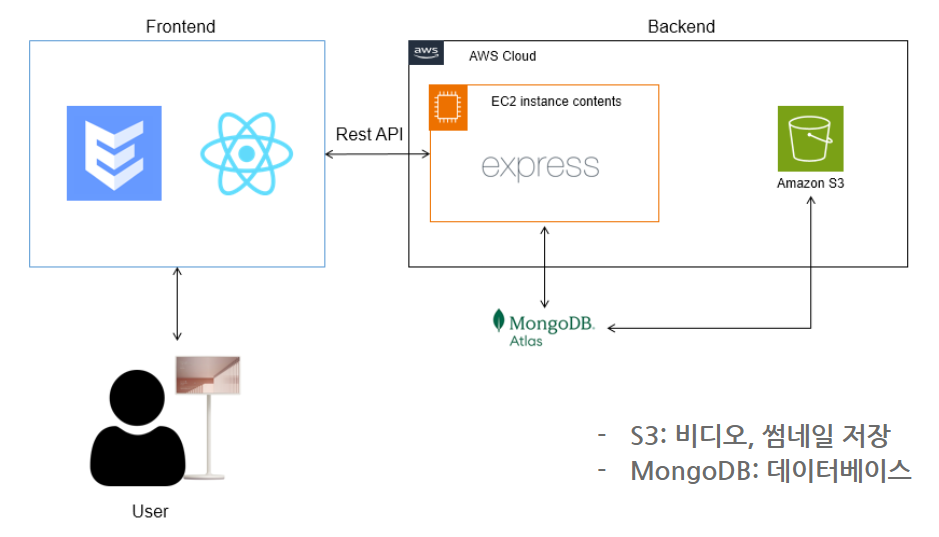
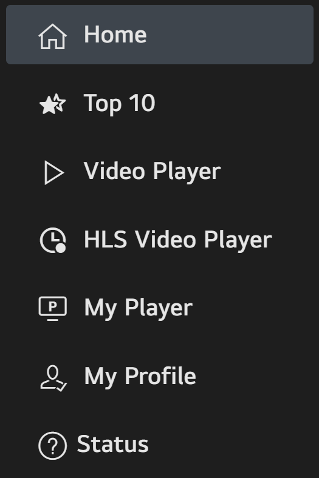
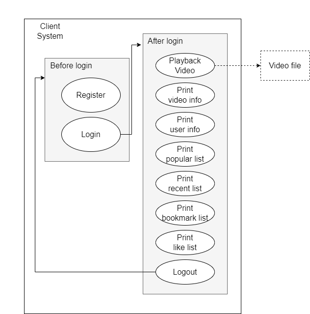
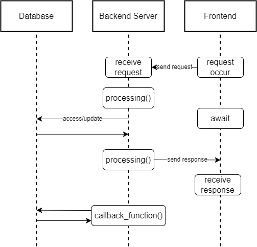
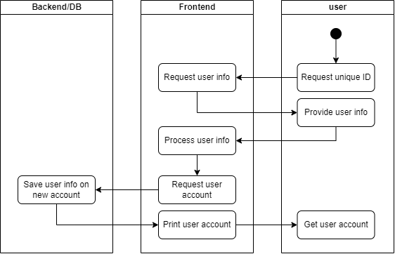
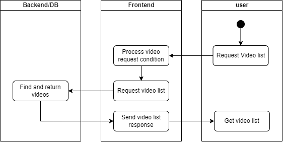
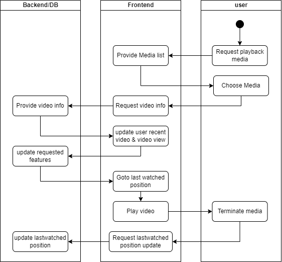

## 1. 서론 (Introduction)

### 1.1 목적 (Purpose)

- 본 문서는 웹OS 기반의 미디어 컨텐츠 재생과 이를 사용하면서 발생하는 사용자 로그 및 미디어 데이터를 추출하고 서버로 전송하는 클라이언트 프로그램의 요구사항과 기술적 특성을 포함한다.

### 1.2 범위 (Scope)

이 문서에는 아래의 요구 사항이 포함되어 있다.

- 로컬에 저장되어 있는 미디어 컨텐츠를 재생합니다.
- 미디어 재생과정에서 사용자 로그 및 미디어 데이터를 추출하고 서버로 전송합니다.
- 사용자 인증 및 프로필 관리를 통한 개인화된 사용자 경험을 제공합니다.
- 사용자 선호도에 따른 비디오 추천 및 개인화된 피드 제공합니다.
- 시스템 상태 정보(예: CPU, 메모리 사용량)를 모니터링합니다.
- 다양한 미디어 포맷을 지원하기 위한 적응형 스트리밍 기능을 포함합니다.
- 웹OS 기반의 스마트 TV에서 효과적으로 동작하는 사용자 인터페이스를 구현합니다.

### 1.3 용어 및 약어 정리 (Definitions and Abbreviations)

- Codec (Coder & Decoder) : 음성 또는 영상의 신호를 디지털 신호로 변환하는 코더와 그 반대로 변환시켜 주는 디코더를 통틀어 부르는 용어이다.
- GUI (Graphic User Interface) : 사용자가 편리하게 사용할 수 있도록 입출력 등의 기능을 알기 쉬운 아이콘 따위의 그래픽으로 나타내서 사용자와 컴퓨터가 상호 작용하는 방식이다.
- CLI (Command Line Interface) : 텍스트 터미널을 통해 사용자와 컴퓨터가 상호 작용하는 방식이다.
- UI (User Interface) : 사용자와 사물 또는 시스템, 컴퓨터 프로그램 등 사이에서 의사소통을 할 수 있도록 일시적 또는 영구적인 접근을 목적으로 만들어진 물리적, 가상적 매개체를 뜻한다.
- POSIX (Portable Operating System Interface) : 서로 다른 UNIX OS의 공통 API를 정리하여 이식성이 높은 유닉스 응용 프로그램을 개발하기 위한 목적으로 IEEE가 책정한 애플리케이션 인터페이스 규격이다.
- API (Application Programming Interface) : 응용 프로그램에서 사용할 수 있도록, 운영 체제나 프로그래밍 언어가 제공하는 기능을 제어할 수 있게 만든 인터페이스를 뜻한다.
- Node.JS : 구글 크롬의 자바스크립트 엔진(V8 Engine)에 기반해 만들어진 서버 사이드 플랫폼으로 확장성이 있는 네트워크 애플리케이션 개발에 사용된다.
- React: 사용자 인터페이스를 구축하기 위한 JavaScript 라이브러리이다. 컴포넌트 기반의 접근 방식을 통해 효율적인 UI 개발을 가능하게 한다.
- Enact: 대형 화면 기기를 위한 사용자 인터페이스 개발에 특화된 React 기반의 응용 프로그램 프레임워크이다. 성능 최적화, 접근성, 국제화를 포함한 다양한 기능을 갖추고 있으며, webOS 플랫폼과의 호환성에 중점을 둔다.
- Express : Node.js를 위한 웹 프레임워크의 하나로, Node.js의 핵심 모듈인 http와 Connect 컴포넌트를 기반으로 하는 웹 프레임워크다. 웹 애플리케이션, API 개발을 위해 설계되었다.
- Redux: JavaScript 앱의 상태 관리를 위한 라이브러리이다. 애플리케이션의 상태를 중앙 집중식 저장소에서 관리하여 일관된 동작과 쉬운 상태 관리를 가능하게 한다.
- MongoDB: 크로스 플랫폼 도큐먼트 지향 데이터베이스 시스템이다. NoSQL 데이터베이스로 분류되는 mongoDB는 JSON과 같은 동적 스키마형 도큐먼트들을 선호함에 따라 전통적인 테이블 기반 관계형 데이터베이스 구조의 사용을 삼간다.
- HLS: Apple Inc.에 의해 개발된 비디오 스트리밍 프로토콜이다. 적응형 스트리밍을 지원하여 다양한 네트워크 속도와 장치에서 안정적인 스트리밍을 제공한다. HLS는 m3u8 재생 목록 파일을 통해 콘텐츠를 전달한다.
- Luna Service API: webOS TV에서 제공하는 핵심 서비스와 기능을 포함하는 API로, webOS 시스템 서비스와의 통신을 가능하게 해준다. Luna Service API를 통해 다양한 시스템 기능에 액세스하고, 사용자 정의 기능을 webOS에 통합할 수 있다.

## 2. 종합기술 (Overall Description)

### 2.1 시스템 인터페이스 (System Interface)

- 시스템은 리눅스 환경을 기반으로 하며, Frontend는 Enact를 사용하여 UI를 구현하여 사용자와 소통한다. Backend는 node.js로 시스템을 구축하고 mongoDB를 이용하여 사용자와 미디어 데이터를 관리한다. Frontend와 Backend는 REST API 규약에 따라 로컬 서버에서 소통한다.

### 2.2 시스템 컨텍스트 (System Context)

**User**

프로그램을 사용하는 사용자를 의미한다. 사용자는 frontend에서 제공하는 인터페이스를 통해 지원하는 기능을 사용할 수 있다.

**FrontEnd**

Frontend의 주 기능은 사용자에게 미디어 재생 기능을 지원하는 것이다. 재생 가능한 미디어의 목록을 사용자에게 제공하고 이어보기 기능을 지원하기 위해 미디어의 목록과 사용자의 재생 기록 정보를 요청하거나 사용자의 정보를 갱신하기 위해 backend와 상호작용한다. 부가적으로 사용자에게 기기의 시스템 자원 데이터 현황과 사용자의 프로그램 사용 경향을 시각적으로 제공한다.

**BackEnd**

Frontend에서 요청하는 정보를 제공하기 위한 서버이다. 사용자 정보와 미디어 정보를 데이터베이스에 저장하여 관리하는 주체이며, frontend의 데이터 생성 및 삭제, 수정 요청을 처리한다. 시스템 현황은 Frontend의 요청이 있을 경우에만 정보를 갱신하여 전달한다.

*사용자 정보 : username, email, password, profilePicture, gender, age, likedVideos, bookmarkedVideos, recentVideos, accessTimes*

*미디어 정보 : title, subtitle, description, thumb, source, bookmark, like, views*

### 2.3 사용자 인터페이스

- 사용자들의 편리성을 중심으로 사용자 정보와 미디어 목록을 제공한다. 플레이어 화면에서는 재생, 일시정지, 중지, 앞으로 10초 감기 등의 기능을 사용할 수 있도록 UI를 구성하도록 한다.

## 3. 상세 요구사항 (Specific Requirements)

### 3.1 기능 요구사항 (Functional Requirements)

### 3.1.1 회원가입 및 로그인

1. `FR01`: 회원가입
    - `FR01-1`: 사용자로부터 회원가입 요청을 받으면 사용자 정보(username, email, password, age, gender)를 입력받고, 사용할 수 있는 사용자 계정 발급한다.
    - `FR01-2`: 사용자가 선택할 수 있는 프로필 이미지 리스트를 제공하고, 선택한 프로필 이미지를 계정 정보에 추가한다. 추후 프로필 이미지를 클릭하면 언제든지 수정이 가능하게 한다.
2. `FR02`: 로그인
    - `FR02-1`: 사용자로부터 로그인 요청을 받으면 사용자 이메일과 password를 입력받고, backend의 데이터베이스에 등록되었는지 여부를 확인해 등록되어 있다면 로그인을 수행한다.

### 3.1.2 로그인 이후

1. `FR03`: Home 탭. 재생 가능한 미디어 목록 출력
    - `FR03-1`: 사용자가 로그인 한 직후, 홈 화면에 재생 가능한 미디어 목록을 전부 나열한다.
    - `FR03-2`: 나열된 미디어들은 썸네일 이미지, 제목의 정보가 같이 보이도록 한다.
    - `FR03-3`: 미디어 썸네일을 클릭하면 HLS 스트리밍이 가능한 미디어는 HLS Video Player로, 아닌 미디어는 기본 Video Player로 넘어가 동영상이 재생된다.
2. `FR04`: Top 10 탭. 재생 가능한 미디어 중 조회수가 제일 높은 10개의 미디어 목록을 나열한다.
    - `FR04-1`: 전체 사용자의 조회수 내림차순으로 정렬하여 상위 10개만 출력한다.
    - `FR04-2`: 사용자와 성별이 같은 사용자들의 조회수만 계산하여 상위 10개를 출력하는 gender picked top 10을 별도로 하단에 출력한다.
3. `FR05`: Video Player 탭. mp4파일 등 adaptive streaming이 불가능한 미디어 파일들을 재생하는 기본 플레이어이다.
   
   
    
    - `FR05-1`: 사용자가 선택한 미디어에 대해 이전에 재생한 기록이 있으면 해당 위치부터 재생을 시작한다.
    - `FR05-2`: 미디어 재생 중 첫 번째 버튼을 누르면 이전 페이지로 이동한다.
    - `FR05-3`: 미디어 재생 중 두 번째 버튼을 누르면 CPU, memory 사용량을 퍼센트로 계산해 화면에 시각화한다.
    - `FR05-4`: 미디어 재생 중 세 번째 버튼을 누르면 재생 속도를 조절한다.
    - `FR05-5`: 미디어 재생 중 네 번째 버튼은 사용자의 북마크를 관리한다.
        - `FR05-5-1`: 북마크가 되어있는 경우 북마크가 취소된다.
        - `FR05-5-2`: 북마크가 되어있지 않은 경우 북마크된다.
    - `FR05-6`: 미디어 재생 중 다섯 번째 버튼은 사용자의 좋아요를 관리한다.
        - `FR05-6-1`: 좋아요가 되어있는 경우 좋아요가 취소된다.
        - `FR05-6-2`: 좋아요가 되어있지 않은 경우 좋아요된다.
    - `FR05-7`: 미디어 재생 중 여섯 번째 버튼을 누르면 동영상이 전체화면으로 재생된다.
5. `FR06`: HLS Video Player 탭. m3u8파일이면 adaptive streaming을 제공하기 위한 플레이어이다.
   
    
    
    - `FR06-1`: 첫 번째 버튼을 누르면 이전 페이지로 돌아간다.
    - `FR06-2`: 두 번째 버튼을 누르면 CPU, memory 사용량을 퍼센트로 계산해 화면에 시각화한다.
    - `FR06-3`: 세 번째 버튼은 사용자의 북마크를 관리한다.
        - `FR05-6-1`: 북마크가 되어있는 경우 북마크가 취소된다.
        - `FR05-6-2`: 북마크가 되어있지 않은 경우 북마크된다.
    - `FR06-4`: 네 번째 버튼은 사용자의 좋아요를 관리한다.
        - `FR06-4-1`: 좋아요가 되어있는 경우 좋아요가 취소된다.
        - `FR06-4-2`: 좋아요가 되어있지 않은 경우 좋아요된다.
    - `FR06-5`: 다섯 번째 버튼은 adaptive streaming을 관리한다.
        - `FR06-5-1`: adaptive streaming이 켜져있는 경우 adaptive streaming이 꺼지고 level0의 해상도로 동영상을 제공한다.
        - `FR06-5-2`: adaptive streaming이 꺼져있는 경우 adaptive streaming이 켜지고 현재 네트워크 상황에 최적화된 해상도의 동영상을 제공한다.
7. `FR07`: My Player 탭. 사용자 맞춤형 비디오 목록을 제공한다.
    - `FR07-1`: 사용자가 최근에 시청한 비디오 목록을 나열한다.
    - `FR07-2`: 사용자가 좋아요한 비디오 목록을 나열한다.
    - `FR07-3`: 사용자가 북마크한 비디오 목록을 나열한다.
8. `FR08`: My Profile 탭. 사용자의 앱 사용 현황 데이터 수집, 분석 및 시각화 기능을 제공한다.
    - `FR08-1`: 현재까지의 각 시간대의 사용자 접속 빈도를 표현하여, 시간대 별 활동 패턴을 시각적으로 확인할 수 있도록 한다.
    - `FR08-2`: 최근 7일 동안의 접속 빈도를 그래프로 나타낸다.
    - `FR08-3`: 로그아웃 버튼으로 로그아웃이 가능하도록 한다.
9. `FR09`: Status 탭. 시스템 자원 현황을 시각화하여 그래프로 나타낸다.
    - `FR09-1`: 현재 CPU 현황을 user, system, nice, idle 네 가지 항목으로 나누어 파이 그래프에 나타낸다.
    - `FR09-2`: 현재 Memory 현황을 current vmalloc size, swap used, usable memory 세 가지 항목으로 나누어 파이 그래프에 나타낸다.
    - `FR09-3`: refresh 버튼을 누르면 실시간 현황으로 업데이트 된 데이터를 출력한다.
    - `FR09-4`: TV information을 하단에 출력한다.

### 3.2 품질 속성 (Quality Attribute)

1. `QA01`: 사용자가 이전에 재생한 기록이 있는 미디어를 다시 재생시킬 경우, 미디어 재생 기록 오차를 0.1초 이내로 제공하여 정확한 위치에서 미디어를 재생시킬 수 있다.
2. `QA02`: 최소 100개 이상의 세션에 대한 데이터를 보관할 수 있어야 한다.

### 3.2 제약 사항 (**Constraint Requirement)**

1. `CR01`: 서버와 프레임워크는 Node.js, Express로 사용한다.
2. `CR02`: Frontend는 Enact Framework를 기반으로 한다.
3. `CR03`: 데이터베이스는 MongoDB를 사용하고, MongoDB Atlas를 사용하여 호스팅한다.
4. `CR04`: 백엔드 배포는 Amazon EC2 인스턴스를 활용한다. 또한, 동영상과 썸네일 데이터는 Amazon S3에 저장한다.

# 4. Architecture Overview

## 4.1 **Static Perspective**

### 4.1.1 Frontend architecture

- `FR01`: RegisterPage component
    - validateInputs(): user 정보가 모두 포함되어 submit 가능한 형태인지 체크한다.
    - handleSubmit(): 회원가입을 위해 작성된 user정보를 back server로 전송한다.
- `FR02`: LoginPage component
    - handleLogin(): 사용자가 입력한 이메일과 비밀번호로 back server와 소통해 로그인을 시도한다.
- `FR03`: Home component
    - fetchVideos(): 재생 가능한 모든 비디오 목록을 back server로부터 가져온다.
- `FR04`: Top10 component
    - fetchTopVideos(): total과 gender 카테고리의 조회수가 가장 높은 동영상을 최대 10개 가져온다.
- `FR05`: Video component
    - fetchIcons(): 좋아요와 북마크 여부로 버튼의 아이콘을 결정해 그려준다.
    - fetchVideos(): 사용자가 선택한 비디오의 id로 back server로부터 비디오 정보를 가져와 재생한다.
    - handlePopupOpen(): 사용자가 좋아요 혹은 북마크를 누르면 해당 요청을 수행한다.
    - handleStatClick(): 사용자가 stat 버튼을 누르면 시스템 현황을 띄우거나 띄우지 않는 토글 기능을 한다.
    - gotoStartTime(): seek 함수를 사용해 사용자가 이전에 재생했던 부분으로 비디오의 시작 지점을 옮긴다.
    - setPlayBack(): 사용자가 speed 버튼을 누르면 재생속도를 조절한다.
    - Status(): 시스템 자원 현황을 불러와 현재 사용량을 계산해 화면에 그린다.
    - useInterval(): 시스템 현황을 1초마다 갱신하기 위한 함수이다.
- `FR06`: HLS Video component
    - hls(): hls가 지원되는 동영상이면 Hls 객체를 생성해 매 비디오 segment마다 adaptive streaming이 지원되도록 한다.
- `FR07`: MyPlayer component
    - fetchRecentVideos(): 최근에 사용자가 시청한 비디오 목록을 back server로부터 가져온다.
    - fetchLikedandBookmarkedVideos(): 사용자가 좋아요하고 북마크한 동영상 리스트를 back server로부터 가져온다.
- `FR08`: MyProfile component
    - prepareBarData(): 막대그래프를 그려주기 위한 기본 세팅을 한다.
    - screenTimeData(): 렌더링 시 가져온 사용자의 사용 빈도 데이터를 막대그래프로 그리기 위해 세팅한다.
    - handleLogout(): 사용자를 로그아웃 시킨다.
- `FR09`: Status component
    - renderTVInfo(): tv 정보를 불러와 그려준다.
    - setData(): setCpu()와 setMem()의 luna call을 통해 실시간으로 시스템 현황을 불러온다. refresh버튼을 누를 때마다 호출되어 데이터가 갱신된다.
    - CpuPieData()/MemPieData: cpu와 memory 데이터를 파이그래프로 시각화하기 위해 세팅한다.

### 4.1.2 Backend architecture

- `BA01`: ScreenTime component
    - isSameDate(): 두 시간이 같은 날&같은 시간인지 확인한다.
    - updateAccessTimes(): 사용자의 최근 접속시간을 업데이트하고 스크린타임을 업데이트 한다.
- `BA02`: Update component
    - updatePopularVideo(): 1시간마다 인기 동영상을 업데이트 한다.
    - resetWeekAccessTimes(): 1주일에 한번씩 모든 유저의 스크린타임을 초기화한다.
- `BA03`: Middleware component
    - isLoggedIn(): 현재 로그인 된 상태인지 확인한다.
    - isNotLoggedIn(): 현재 로그아웃 된 상태인지 확인한다.

## 4.2 Dynamic Perspective

### 4.2.1 State diagram

- 로그인 이전 상태에서 **Login** 을 통해 로그인 이후 상태로 변경할 수 있다. 이 때, 서버에서 **Login** 에서 입력받은 id값과 password가 일치해야 로그인 상태로 변경될 수 있다. 등록되지 않은 id이거나 password가 맞지 않을 경우 로그인에 실패한다.
- 로그인 이후 상태에서는 **Logout**을 통해 로그인 이전 상태가 된다.

### 4.2.2 Sequence diagram

사용자의 요청에 따라 서버 혹은 DB와 통신하는 경우 수행되는 동작이다.

- user는 frontend의 UI와 상호작용하고, 데이터 요청이 발생하면 backend로 request를 보낸다.
- Backend에서는 받은 request를 database와 소통하며 처리한다.
- 처리된 작업에 대한 response는 다시 frontend로 보내진다.
- Backend는 특정 시간마다 callback_function을 호출해 popular video 등의 데이터를 최신으로 유지한다.

### 4.2.3 Module

1. User register
    - 사용자 정보를 입력받아 새로운 계정 생성 및 Database에 저장한다.
  

2. Login
    - 사용자에게서 email과 password를 입력받아 로그인을 진행한다.
    - 로그인에 성공하면 서버의 user state를 업데이트한다.

3. Video list request
    - 사용자가 비디오 리스트(popular, recent, liked…)를 요청하면 서버로부터 비디오 리스트를 받아온다.

4. Play video
    - 사용자가 재생하고 싶은 비디오를 고르면 backend DB에서 비디오의 정보를 가져온다. 이 때, 마지막으로 재생한 위치의 정보도 포함된다.
    - 선택된 비디오의 조회수와 사용자의 최근 비디오를 업데이트한다.
    - 마지막으로 재생한 위치에서부터 비디오를 재생한다.
    - 사용자가 비디오 재생을 종료하면 마지막 재생한 위치 정보를 업데이트한다.

5. Logout
    - 로그인 이후 상태에서 로그인 이전 상태로 변경한다.
  
# 5. Data Design

## Video 스키마

| 필드명 | 설명 |
| --- | --- |
| title | 비디오 제목 |
| subtitle | 비디오 제작자 또는 부제목 |
| description | 비디오에 대한 설명 |
| thumb | 비디오 썸네일 이미지 |
| source | 비디오 파일의 URL |
| bookmark | 북마크된 횟수 |
| like | 좋아요한 횟 |
| views | 비디오 조회수를 나타냅니다. |
| genderViews | 성별에 따른 조회수 |

### 기능 요구사항 (Functional Requirements)

1. **미디어 정보 저장**
    - `FR03-1`: 홈 화면에 재생 가능한 미디어 목록을 표시한다. (title, thumb, subtitle)
    - `FR03-2`: 미디어 정보는 썸네일 이미지와 제목, 작성자(subtitle)를 포함하여 나열된다.

### 품질 속성 (Quality Attribute)

1. **미디어 재생 정확도**
    - `QA01`: 사용자가 이전에 재생한 미디어를 다시 재생할 때, 정확한 위치에서 재생시킬 수 있도록 0.1초 이내의 오차를 제공한다.

---

## User 스키마

| 필드명 | 설명 |
| --- | --- |
| username | 사용자의 이름 또는 닉네임 |
| email | 사용자의 이메일 주소. 고유해야 하고 이메일 형식에 맞아야 한다. |
| password | 사용자의 암호화된 비밀번호. |
| profilePicture | 사용자의 프로필 사진을 나타내는 숫자로, 1부터 15까지의 범위 내에서 설정된다. |
| gender | 사용자의 성별을 나타내며 여성, 남성, 기타 중 하나여야 한다. |
| age | 사용자의 나이. 0 이상이어야 한다. |
| likedVideos | 사용자가 좋아하는 비디오의 ObjectId 배열 |
| bookmarkedVideos | 사용자가 즐겨찾는 비디오의 ObjectId 배열 |
| recentVideos | 사용자가 최근에 시청한 비디오와 마지막 시청 시간(초)을 저장하는 배열 |
| accessTimes | 사용자의 총 스크린 타임을 24시간 단위로 저장하는 배열 |
| weekAccessTimes | 사용자의 이번 주 스크린 타임을 저장하는 배열 |
| lastRequestTime | 사용자의 마지막 요청 시간 |

### 기능 요구사항 (Functional Requirements)

1. **회원가입**
    - `FR01-1`: 사용자 정보를 입력받고 사용자 계정을 발급한다. (username, email, password, age, gender)
    - `FR01-2`: 프로필 이미지 리스트를 제공하고 선택한 이미지를 사용자 정보에 추가한다. (profilePicture)
2. **로그인**
    - `FR02-1`: 사용자 이메일 비밀번호를 입력받아 등록 여부를 확인하고 로그인한다.

### 품질 속성 (Quality Attribute)

1. **정보 보관 용량**
    - `QA02`: 최소 100개 이상의 세션에 대한 데이터를 보관할 수 있어야 한다.

---

## PopularVideos 스키마

| 필드명 | 설명 |
| --- | --- |
| male | 'Video' 모델을 참조하는 male 비디오 배열 |
| female | 'Video' 모델을 참조하는 female 비디오 배열 |
| other | 'Video' 모델을 참조하는 다른 비디오 배열 |
| total | 'Video' 모델을 참조하는 전체 비디오 배열 |

### 기능 요구사항 (Functional Requirements)

1. **인기 있는 비디오 추적**
    - `FR04-1`: 성별에 따른 조회수를 기록하여 인기 있는 동영상을 추적하고 주기적으로 업데이트 한다. (genderViews)
2. **Top 10 탭**
    - `FR04-1`: 전체 사용자의 조회수 내림차순으로 정렬하여 상위 10개만 출력한다.
    - `FR04-2`: 사용자와 성별이 같은 사용자들의 조회수만 계산하여 상위 10개 동영상을 별도로 출력한다.

# 6. Architecture/Design Decisions

## Frontend

- **비디오 플레이어 탭 활용:** **`TabLayout`** 의 비디오 플레이어 활용하여 영상 재생
    - 결정 근거:
        - 사용자 경험 개선: 별도의 화면으로 전환하지 않고 탭 내에서 비디오 재생으로 사용자의 편의성 증대.
        - 효율적인 화면 전환: 다른 화면으로 이동하는 번거로움 최소화하여 원활한 사용자 인터랙션 유지.
    - trade-off/대안:
        - 내장형 플레이어: 화면 공간의 제한적 이용으로 인한 사용자의 시청 경험에 영향.
        - 별도의 재생 화면: 전체 화면 비디오 재생 옵션을 제공하지 않음으로써 대화형 사용자 경험에 중점.
        
- **시각화 도구 변경:** **`nivo`**에서 **`Chart.js`**로 전환
    - 결정 근거:
        - 호환성 문제 해결: **`webOS`**와 **`Enact`** 프레임워크에서 일부 React API 지원하지 않아 **`nivo`** 사용 시 랜더링 문제 발생. **`Chart.js`**는 이러한 문제를 해결하고 더 나은 호환성 제공.
        - 안정적인 시각화 성능: **`Chart.js`**는 안정적인 성능과 넓은 호환성을 제공하여 프로젝트 요구사항에 부합.
    - trade-off/대안:
        - 시각적 다양성 감소: **`nivo`**가 제공하는 시각적 다양성과 유연성을 **`Chart.js`**가 완전히 대체하지 못할 수 있음.
        - 기술적 재조정: 기존에 **`nivo`**에 맞춰진 코드와 데이터 구조를 **`Chart.js`**에 맞게 재조정 필요.
        
- **라우팅 방식 변경:** **`BrowserRouter`**에서 **`HashRouter`**로 전환
    - 결정 근거:
        - 호환성 문제 해결: **`webOS`**와 **`Enact`** 환경에서 **`BrowserRouter`** 사용 시 화면 로드 문제 발생. **`HashRouter`**는 클라이언트 단에서의 라우팅 처리를 가능하게 하여 이 문제 해결.
        - TV 화면 지원 강화: TV와 같은 특정 환경에서 더 나은 호환성과 안정적인 화면 로드를 위해 **`HashRouter`** 사용.
    - trade-off/대안:
        - URL 구조 변경: **`HashRouter`** 사용으로 인한 URL의 해시(#) 기반 구조로 변경, 일부 경우에서 URL 가독성 감소.
        - History API 사용 제한: 기존 **`BrowserRouter`**가 제공하는 History API의 일부 기능 사용 제한.
    
- **이어보기 기능 개선:** 비디오 스탬프 활용 및 수동 재생 기능 구현
    - 결정 근거:
        - 사용자 경험 개선: 사용자가 이전에 중단했던 지점부터 비디오 재생을 시작하여 사용자 경험 향상.
        - 문제 해결: 이전 시청 지점을 기억하는 기능이 정상적으로 작동하지 않아 발생한 문제를 **`video_stamp`** 변수 사용 및 수동 재생으로 해결.
    - 문제 해결 방법:
        - 비디오 스탬프 사용: **`videoRef.current.getMediaState().currentTime`**을 통해 현재 비디오 재생 위치 추출 및 이어보기 기능 구현에 활용.
        - 수동 재생 설정: 자동재생시 이어보기 시간이 반영되지 않는 문제 해결을 위해 비디오 재생을 수동으로 변경.
        - 비디오 로드 시 이전 시청 지점 (**`videostamp`**)으로 이동하도록 **`gotoStartTime`** 함수에서 **`videoRef.current.seek(videostamp)`** 호출.
        - 사용자가 비디오를 떠날 때 현재 시청 지점 (**`video_stamp`**)을 저장하여 데이터베이스에 업데이트.
    - trade-off/대안:
        - 사용자 경험: 자동재생 기능 제거로 인해 사용자가 수동으로 재생을 시작해야 하는 불편함 존재.
        - 데이터 관리: 각 비디오마다 마지막 시청 지점을 관리해야 하는 데이터 저장 및 업데이트 필요.

- **Status 시각화**: Status tab 따로 구현 및 미디어 플레이 시 정보 간소화
    - 결정 근거:
        - 사용자 친화적 UI 제공: 미디어 재생 시 보이는 시스템 현황 정보를 cpu와 memory 사용 퍼센트만 보여주어 간략화. 사용자의 감상을 방해하지 않으면서도 필요한 내용을 제공하여, 편리하고 무난한 비디오 시청 환경을 제공.
        - 시스템 Status 탭을 도입하여, 각종 시스템 정보를 파이 그래프 형태로 시각화함으로써, 사용자가 직관적이고 한눈에 알아볼 수 있도록 함. 이를 통해 복잡한 시스템 상태를 간결하게 전달.
    - trade-off/대안:
        - 정보의 간소화: 미디어 재생 중에는 사용자가 시스템 현황을 구체적으로 알기 어려움.
    
- **Status 현황 업데이트 주기**: 미디어 재생 시에는 자동으로 1초마다 갱신
    - 결정 근거:
        - 사용자 편의성 강화: 사용자가 미디어를 재생 중일 때, 미디어에 집중하면서도 시스템 현황을 실시간으로 업데이트하기 어려운 상황을 고려. 이를 통해 사용자는 별도의 작업 없이도 언제든지 최신 시스템 정보를 확인할 수 있어 더 효율적이고 편리한 환경을 제공.
    - trade-off/대안:
        - 불필요한 CPU 사용량이 발생할 수 있고, 특정 주기로 업데이트하여 정보를 확인하는 유저의 요구를 충족하지 못하는 한계 발생.
        - 사용자가 주기적인 갱신 주기를 설정할 수 있도록 하는 기능을 추가하는 대안.

## Backend

- **모델 분할:** `User/Video/PopularVideo`
    - 결정 근거:
        - `PopularVideo` 모델 분리: 인기 비디오가 여러 기준에 따라 달라서 별도 모델로 분리함.
        - 인기 비디오 업데이트 주기: 매 시간마다 업데이트하여 API 호출 시 서버 부하 감소.
    - trade-off/대안:
        - 별도 모델 생성: 테이블 관리 및 추가적인 데이터베이스 작업 필요.
        - 전역 배열: 관리 용이성을 위해 전역 배열 대신 테이블 생성 및 관리 선택.

- **스크린타임 구현**
    - 현재 스크린타임 형식:
        - User 모델에 24시간 배열로 저장되어 있으며, Socket을 사용하지 않기 때문에 정확한 접속 시간 측정이 어려움.
        - 요청 시간과 `lastRequestedTime`을 비교하여 업데이트되며, 하루에 최대 1번만 업데이트됨.
        - 한국 시간을 기준으로 현재 시간을 구하기 위해 Day.js 라이브러리를 활용하여 시간대를 설정함.
    - 주간 스크린타임 계산:
        - 주간 스크린타임을 월~일까지의 기간으로 측정함.
        - `node-cron`을 활용하여 매주 일요일 자정에 모든 유저의 이번주 스크린타임 배열을 초기화함.
    
- **서버 배포**
    - 결정 근거:
        - reference가 많고 개발 난이도가 낮아 EC2 인스턴스를 활용하여 배포함.
        - 비용 문제로 저렴한 인스턴스를 선택함. 인스턴스 크기가 크지 않아 동시에 많은 요청이 들어올 경우 서버가 불안정하다는 단점이 있음.
    - 대안:
        - Lambda 서버리스 API를 활용한 배포: 백엔드는 stateless하므로 세션을 별도로 처리해야 함.
            
            고려한 점:
            
            - 장점: 유동적인 트래픽에 적응하여 서버를 자동으로 확장하고 축소함.
            - 단점: 세션 관리 등의 추가적인 처리가 필요함.
        - 오토스케일링(EC2 인스턴스) : 여러 EC2 인스턴스를 사용하여 오토스케일링 구성함.
            
            고려한 점:
            
            - 장점: 트래픽 증가 시 자동으로 인스턴스를 늘리고, 감소 시 자동으로 축소하여 안정적인 서버 환경을 구성함.
            - 단점: 구성 및 관리에 대한 복잡성과 비용 증가가 발생할 수 있음.
